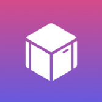
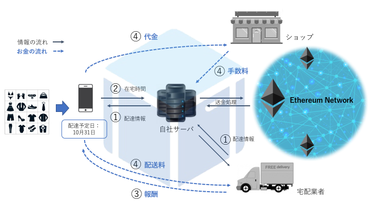

# My Block

## 製品概要

ブロックチェーンに基づいた決済機能と宅配情報管理を実現するシステムである。
これにより、決済にかかる手数料を安くし、再配達を減らすことができる。

### Block Tech
Block Chain Technology

### 背景

#### 再配達問題と仮想通貨の進歩
現在、宅配業界では再配達は膨大な数になっており、企業は減少させるための努力に挑戦している。その代表的な一つは宅配ボックスであり、一定の成果を生み、宅配業界の負担を軽減している。しかし、現状の再配達数はまだまだ多く、多方面のアプローチが必要とされている。

一方でブロックチェーン技術が発達し、高いセキュリティを保ちながら決済にかかる手数料を格安にすることが可能となった。

以上のことをまとめると、

##### 配達業者の再配達による社会的損失！！
再配達により無駄になっている労働力は、年間1.8億時間=約3000億円。

##### クレジットカード決済では、仲介会社により約5%程度の手数料が！！
仮想通貨ならほぼ0%の手数料で決済が可能に。

##### paypal決済などでは、送金が最後までされない事例もあり、電子決済を導入できない例も...
仮想通貨なら確実に送金されるため、お店側も安心！ブロックチェーンによりセキュリティも担保。

My Blockは時代の背景を鋭く洞察して、先進的な解決を提案するシステムである。
消費者は決済から荷物の受け取りまでを少ない手数料で簡単に！そして、新しく導入した消費者報酬システムにより、宅配業者は再配達を減らす！お店側は決済手数料を少なくできる。

### 製品説明
My Blockは、仮想通貨決済と配達情報を連動させることで販売者と配達業者、消費者のハブとなり、無駄の無い流通を実現する。消費者からは在宅時間を、配達業者からは配達情報を相互に提供し合い配達の効率を高める。そして、消費者が再配達の削減に貢献したら報酬を払う。

構築したシステムの構成は以下になる。

消費者のシステムの利用方法は、
1. 消費者がお店から仮想通貨で購入すると、自動的に配達状況が配達管理アプリに反映される。
2. 消費者は在宅時間を事前に知らせておくことができる。
3. 事前に知らせた時間に1回目で荷物を受け取れば、仮想通貨による報酬を貰うことができる。
4. お店への送金は、購入時に入力した仮想通貨の口座に基づき確実に行われる。My Blockは、この一連の流れの中で1%ほどの手数料を頂く。

### 特徴
#### 消費者報酬システム
このシステムは、消費者が1回で宅配を受け取ることができたら報酬を貰えるという仕組みである。
この報酬は仮想通貨という形で与えられるため、ポイント等と異なり利用の幅も広く、使い勝手が良い。   
今まで消費者側にとっては、「1回目の配達で受け取ること」そのものに価値は薄く、再配達に意識が向くことは少なかった。しかしながら、 **報酬** という形で再配達を減らすための **インセンティブ** を設けることによって、より最適な宅配を、宅配業者と消費者がともに目指していける社会を目指す。

#### 仮想通貨決済による少ない手数料
送金に仲介業者を挟まないため **1%** という低い手数料を実現する。

#### 利用者にとってのメリット
- 消費者のメリット
  - 仮想通貨決済により、手数料が安くなるため購入金額が減る。
  - 時間を指定することにより、仮想通貨の報酬を貰うことが出来る。
  - ポイントと違い仮想通貨は利用の幅が広く使い勝手が良い。
  - 決済における不正が防げる。
- 宅配業者のメリット
  - 届け先の在宅状況を知ることができます。どのようにリソースを割けばいいのかという統計的なことがわかる。
  - 報酬をコントロールすることにより，配達時間の分散を図る。
(例)宅配数の少ない午前の報酬を高くし，夜の報酬を低くする。
- 店舗のメリット
  - クレジットカード払いによる手数料5%程度が，1%程度まで低下する。

### 今後の展望
EC市場は大きく成長し、低い手数料による安全な送金システムはこれからの時代のニーズにマッチしている。そして仮想通貨決済は、クレジットカード決済に代わる送金方法として伸びることが期待される。
私たちは宅配という分野に絞り、配達の管理から決済までを繋ぐ１つのシステムを構築した。
まずは小規模、中規模の配達からこのシステムを導入したい。

## 開発内容・開発技術
### 活用した技術

* ブロックチェーン
* スマートコントラクト

#### API・データ
今回スポンサーから提供されたAPI、製品などの外部技術があれば記述をして下さい。

*  なし

#### フレームワーク・ライブラリ・モジュール
* Ruby on Rails

#### デバイス
* iOS

### 研究内容・事前開発プロダクト（任意）
ご自身やチームの研究内容や、事前に持ち込みをしたプロダクトがある場合は、こちらに実績なども含め記載をして下さい。

* なし

### 独自開発技術（Hack Dayで開発したもの）

プロダクトに関するものすべてをHack Dayだけで開発した。

* 決済システム
* Railsサーバ
* iOSアプリ
* ECサイト
